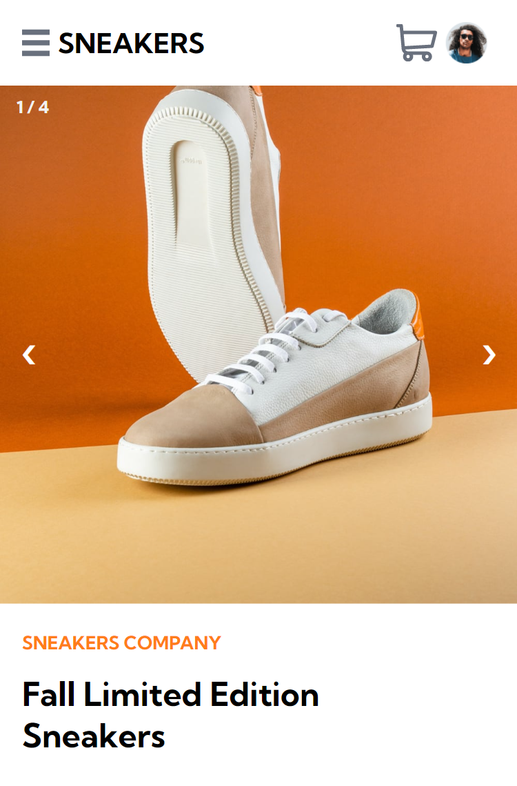

# E-commerce-product-page

>This is a solution to the [E-commerce product page challenge on Frontend Mentor](https://www.frontendmentor.io/challenges/ecommerce-product-page-UPsZ9MJp6). Frontend Mentor challenges help you improve your coding skills by building realistic projects.

# Table of contents

- [E-commerce-product-page](#e-commerce-product-page)
- [Table of contents](#table-of-contents)
- [Overview](#overview)
  - [Built with](#built-with)
  - [Live demo( IF AVAILABLE 😊 )](#live-demo-if-available--)
  - [Getting Started](#getting-started)
    - [Prerequisites](#prerequisites)
    - [Setup](#setup)
  - [Author:](#author)
    - [👩 Taheny BELGUITH](#-taheny-belguith)
    - [🤝 Contributing](#-contributing)
    - [Show your support](#show-your-support)
    - [📝 License](#-license)

# Overview

  

## Built with

- Semantic HTML5 markup
- CSS custom properties
- Mobile-first workflow
- Flex box

## Live demo( IF AVAILABLE 😊 )

[Live Demo](https://tahenybelguith.github.io/Frontend-Mentor---QR-code-component/) 

## Getting Started

> To get a local copy up and running follow these simple example steps.

### Prerequisites

- Github Account
- IDE
- Git

### Setup

- git init
- git clone git@github.com:TahenyBELGUITH/Frontend-Mentor---QR-code-component.git

## Author:

### 👩 Taheny BELGUITH

- GitHub: [@TahenyBELGUITH](https://github.com/TahenyBELGUITH)
- Twitter: [@BelguithTaheny](https://twitter.com/BelguithTaheny)

### 🤝 Contributing

Contributions, issues, and feature requests are welcome!

> Feel free to check the issues page.

### Show your support

Give a ⭐️ if you like this project!

### 📝 License

This project is MIT licensed.
